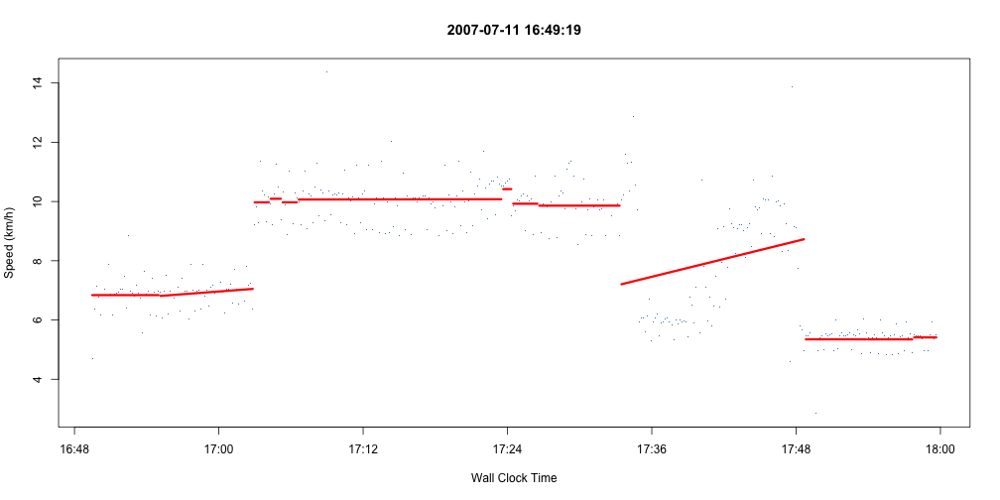

# But I _can_ read XML data ...


```r
source('nikeplus.R')
plus <- read.nikePlus(file.path('xml', '2007-07-11 20;59;57.xml'))
head(plus@intervals[,c("distanceKM","durationMin","diffKM","speedKPH")])
```

```
##   distanceKM durationMin diffKM speedKPH
## 1     0.0000      0.0000     NA       NA
## 2     0.0130      0.1667 0.0130    4.680
## 3     0.0307      0.3333 0.0177    6.372
## 4     0.0505      0.5000 0.0198    7.128
## 5     0.0693      0.6667 0.0188    6.768
## 6     0.0864      0.8333 0.0171    6.156
```

---

# I can use linear models to find breakpoints.


```r
plotNike(plus@intervals, minimumPoints=5, windowSize=7, title=plus@time)
```

 

--- .solo

# [ricko.is/shiny](http://ricko.is/shiny)
